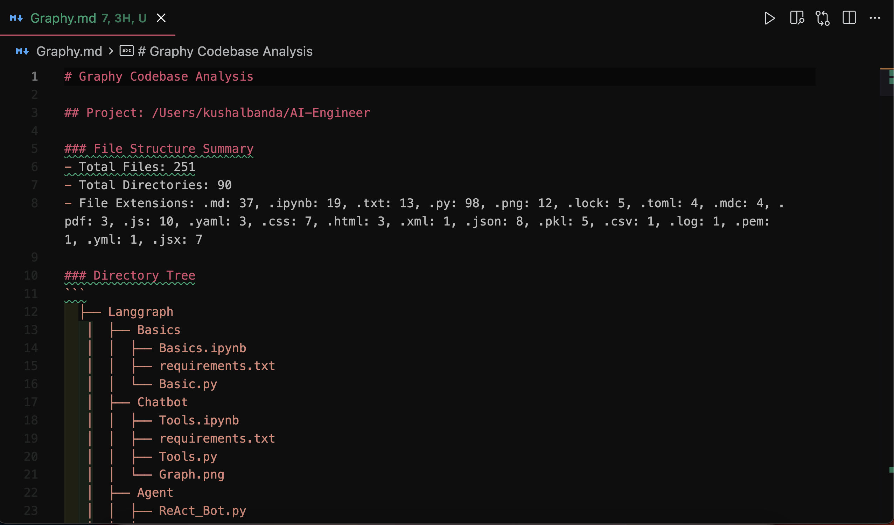
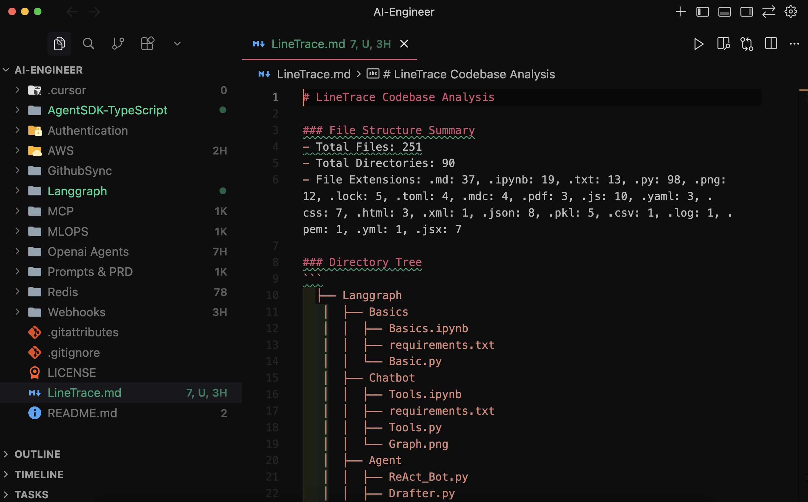

  

# Graphy

**Understand any codebase fast.**

Graphy gives developers a quick, useful map of an unfamiliar repository without leaving the editor. See its structure, measure code size, and find the files that deserve attention first.

## What Graphy Shows

### Codebase report

Run `Graphy: Generate Codebase Analysis` to create `Graphy.md` in your workspace root. The report contains:

- A readable directory tree
- Total file and directory counts
- A breakdown by file extension
- A compact overview you can share in reviews or give to an AI coding tool

### LineLens

LineLens adds live line-count badges to files and folders in the Explorer. Counts refresh as files change, including edits made by Git, terminals, and other tools.

### Line Rank

Line Rank lists workspace files and folders by line count. Expand a folder to see its language breakdown, then open any ranked file directly from the panel.

## Install

[Install Graphy from Open VSX](https://open-vsx.org/extension/kushalBanda/graphy), or search for **Graphy** in an editor that uses the Open VSX Registry.

Graphy supports VS Code-compatible editors running VS Code API `1.91.0` or newer.

## Use

1. Open a folder or workspace.
2. Run `Graphy: Generate Codebase Analysis` from the Command Palette.
3. Read the generated `Graphy.md` report.
4. Use LineLens badges and the Line Rank panel in Explorer for live size signals.

Commands:

- `Graphy: Generate Codebase Analysis`
- `Graphy: Refresh Line Rank`
- `LineLens: Refresh Line Counts`

## Development

The extension source lives in `[graphy/](graphy/)`. See `[graphy/README.md](graphy/README.md)` for registry copy and `[graphy/CHANGELOG.md](graphy/CHANGELOG.md)` for release history.

## License

[MIT](LICENSE)
